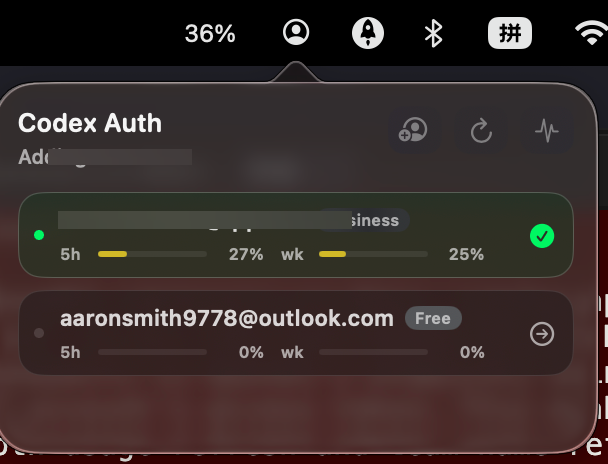

# Codex Auth — macOS Status Bar Edition [](https://github.com/Oreo992/codex-auth/releases/latest)

This is a fork of [`Loongphy/codex-auth`](https://github.com/Loongphy/codex-auth), with an added native macOS menu bar companion for quick account switching and usage checks.

> [!IMPORTANT]
> For **Codex CLI** and **Codex App** users, switch accounts, then restart the client for the new account to take effect.

## macOS Status Bar



- Menu bar icon with active account tooltip
- Small panel showing account, 5h/weekly usage with color-coded progress bars
- Click to switch accounts, or add new ones via `codex-auth login`
- Liquid Glass on macOS 26+, material fallback on older versions

### Install

Download from [Releases](https://github.com/Oreo992/codex-auth/releases):

- [CodexAuthStatusBar-macos.zip](https://github.com/Oreo992/codex-auth/releases/download/macos-statusbar-v0.3.0-alpha.2/CodexAuthStatusBar-macos.zip)

Unzip and open `CodexAuthStatusBar.app`. The app looks for `codex-auth` in `PATH` and common locations.

### Run Locally

```shell
sh scripts/macos-statusbar.sh
```

Or build the `.app` bundle:

```shell
sh scripts/build-macos-statusbar-app.sh
open dist/CodexAuthStatusBar.app
```

### Verify

```shell
cd macos/CodexAuthStatusBar
swift build
swift run CodexAuthStatusBarSelfTest
```

## CLI

The original [`codex-auth`](https://github.com/Loongphy/codex-auth) CLI is unchanged in this fork. Install via npm:

```shell
npm install -g @loongphy/codex-auth
```

Supported clients: Codex CLI, VS Code extension, Codex App.

See the [upstream README](https://github.com/Loongphy/codex-auth) for full command reference.

## Disclaimer

This project is provided as-is. Use at your own risk.
